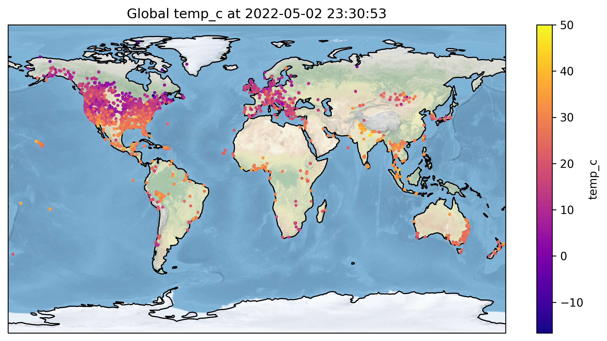

# PurpleAir API

A Python 3.x module to turn data from the PurpleAir/ThingSpeak API into a Pandas DataFrame safely, with many utility methods and clear errors.



## Installation

* To use
  * `pip install purpleair`
  * It is a good practice to only install within a [virtual environment](https://docs.python.org/3/library/venv.html)
* To hack
  * Clone this repo
  * `cd` to the folder
  * Create a virtual environment
    * `python -m venv venv`
  * Activate the virtual environment
    * `source venv/bin/activate`
  * Install as dependency in the virtual environment
    * `python setup.py develop`
  * Install third party dependencies
    * Required to run: `pip install -r requirements/common.txt`
    * Install development requirements with `pip install -r requirements/dev.txt`
    * Install example file requirements with `pip install -r requirements/examples.txt`

## Frequently Asked Questions

Before opening a new ticket, please refer to the [FAQ document](docs/faq.md).

## Example code

For detailed documentation, see the [docs](docs/documentation.md) file.

### Listing all useful sensors

```python
from purpleair.network import SensorList
p = SensorList()  # Initialized 11,220 sensors!
print(len(p.useful_sensors))  # 10047, List of sensors with no defects
```

### Get location for a single sensor

```python
from purpleair.sensor import Sensor
s = Sensor(2890, parse_location=True)
print(s)  # Sensor 2891 at 10834, Canyon Road, Omaha, Douglas County, Nebraska, 68112, USA
```

### Make a DataFrame from all current sensor data

```python
from purpleair.network import SensorList
p = SensorList()  # Initialized 11,220 sensors!
# Other sensor filters include 'outside', 'useful', 'family', and 'no_child'
df = p.to_dataframe(sensor_filter='all',
                    channel='parent')
```

Result:

```log
             lat         lon                          name location_type  pm_2.5  temp_f     temp_c  ...  downgraded age 10min_avg 30min_avg  1hour_avg  6hour_avg  1week_avg
id                                                                                                   ...
14633  37.275561 -121.964134             Hazelwood canary        outside    7.15    92.0  33.333333  ...       False   1      6.50      5.13       4.11      12.44      42.94
25999  30.053808  -95.494643   Villages of Bridgestone AQI       outside   10.16   103.0  39.444444  ...       False   1      9.96     10.63      12.51      18.40      14.55
14091  37.883620 -122.070087                   WC Hillside       outside   11.36    89.0  31.666667  ...       False   1     10.31      8.74       7.21      20.03      63.44
42073  47.185173 -122.176855                            #1       outside   99.46    73.0  22.777778  ...       False   0    100.06    100.31     101.36     106.93      68.40
53069  47.190197 -122.177992                            #2       outside  109.82    79.0  26.111111  ...       False   0    109.52    108.72     109.33     116.64      74.52
```

### Make a DataFrame from all current sensors that have a 10 minute average pm2.5 value

```python
from purpleair.network import SensorList
p = SensorList()  # Initialized 11,220 sensors!
# If `sensor_filter` is set to 'column' then we must also provide a value for `column`
df = p.to_dataframe(sensor_filter='column',
                    channel='parent',
                    column='m10avg')  # See Channel docs for all column options
print(len(df))  # 10,723
```

### Get historical data for parent sensor secondary channel

```python
from purpleair.sensor import Sensor
se = Sensor(2890)
df = se.parent.get_historical(weeks_to_get=1,
                              thingspeak_field='secondary')
print(df.head())
```

Result:

```log
                        created_at  0.3um/dl  0.5um/dl  1.0um/dl  2.5um/dl  5.0um/dl  10.0um/dl  PM1.0_CF_1_ug/m3  PM10.0_CF_1_ug/m3
entry_id
1005219  2020-09-09 00:01:06+00:00    194.84     61.16      5.53      0.00      0.00       0.00              0.45               0.60
1005220  2020-09-09 00:03:06+00:00    224.95     69.07      4.19      0.00      0.00       0.00              0.63               0.86
1005221  2020-09-09 00:05:06+00:00    238.37     71.58      5.42      0.02      0.02       0.02              0.51               0.88
1005222  2020-09-09 00:07:06+00:00    259.61     79.00      8.11      0.96      0.43       0.43              0.71               1.48
1005223  2020-09-09 00:09:06+00:00    254.69     76.66      6.47      0.81      0.67       0.00              0.95               1.50
```

### Get historical data for child sensor primary channel

```python
from purpleair.sensor import Sensor
se = Sensor(2890)
df = se.child.get_historical(weeks_to_get=1,
                             thingspeak_field='primary')
print(df.head())
```

Result:

```log
                        created_at  PM1.0_CF_ATM_ug/m3  PM2.5_CF_ATM_ug/m3  PM10.0_CF_ATM_ug/m3  UptimeMinutes  RSSI_dbm  Pressure_hpa  Blank  PM2.5_CF_1_ug/m3
entry_id
1002561  2020-09-09 00:01:09+00:00                1.03                1.41                 1.41        18136.0      0.01        982.25    NaN              1.41
1002562  2020-09-09 00:03:09+00:00                1.07                1.60                 1.60        18136.0      0.01        982.18    NaN              1.60
1002563  2020-09-09 00:05:09+00:00                1.28                1.59                 1.76        18136.0      0.01        982.10    NaN              1.59
1002564  2020-09-09 00:07:09+00:00                1.33                1.71                 1.71        18136.0      0.01        982.21    NaN              1.71
1002565  2020-09-09 00:09:09+00:00                1.25                1.86                 1.86        18136.0      0.01        982.18    NaN              1.86
```

See examples in `/scripts` for more detail.
